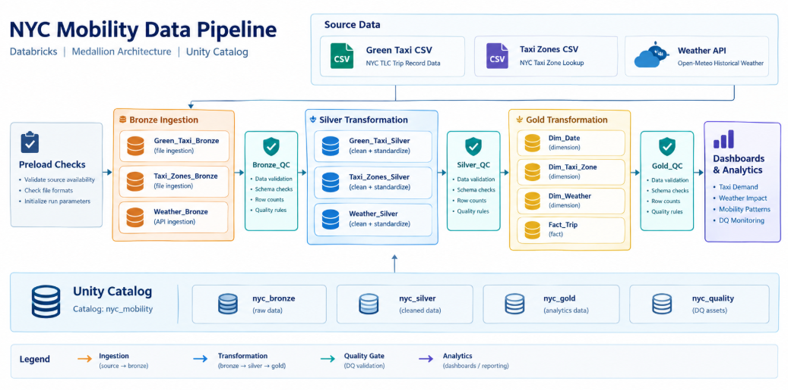

# 🚕 NYC Mobility Extension — Master Engineering & Architecture Guide

[](https://github.com/JoanMaquinano/NYC-Mobility)[cite: 5]
[](https://databricks.com)[cite: 5, 7]
[](https://github.com/features/actions)[cite: 1, 5, 6]
[](https://greatexpectations.io)[cite: 3, 5, 7]

Production engineering documentation for the [NYC-Mobility](https://github.com/JoanMaquinano/NYC-Mobility) data pipeline[cite: 5].

---

## 📌 1. Project Overview & Objectives

This repository extends the existing **NYC Mobility** medallion pipeline on Databricks and Unity Catalog to make it **reliable, repeatable, and collaboration-ready**—without redesigning the underlying core architecture[cite: 5].

Building on integrated taxi trips, weather conditions, and taxi zone metadata, this extension adds automated testing (`pytest`), dual-layer data-quality validation (SQL + Great Expectations), automated CI/CD deployment via Databricks Asset Bundles (DABs), and structured repository governance[cite: 1, 3, 5].

> **As of:** 2026-09-25 · **Active Branch:** `feature/staging-part-2`[cite: 5]

---

## 🏛️ 2. Pipeline Architecture & Data Lineage

The architecture enforces strict data lineage across four Medallion layers and a dedicated Quality schema[cite: 2, 7, 8].

### 2.1 System Architecture Diagram

[cite: 7, 8]

```text
Source Data
  ├── NYC TLC Green Taxi (CSV / Parquet)
  ├── Taxi Zone Lookup (CSV)
  └── Open-Meteo Weather (API / CSV)
    │
    ▼
Preload Checks  (Source availability, File format validation, Run parameters)
    │
    ▼
Bronze Layer Ingestion  (Raw data landing with lineage)
  ├── green_taxi_bronze
  ├── taxi_zones_bronze
  └── weather_bronze
    │
    ▼
Bronze Quality Validation
  ├── Bronze_QC (Data validation, Schema checks, Row counts, Quality rules)
  └── Great Expectations (GX)
    │
    ▼
Silver Layer Transformation  (Cleaned, typed, valid/quarantined)
  ├── green_taxi_silver
  ├── taxi_zones_silver
  └── weather_silver
    │
    ▼
Silver Quality Validation
  ├── Silver_QC (Data validation, Schema checks, Row counts, Quality rules)
  └── Great Expectations (GX2)
    │
    ▼
Gold Layer Modeling  (Analytics dimensional star schema)
  ├── dim_date
  ├── dim_taxi_zone
  ├── dim_weather
  └── fact_trip
    │
    ▼
Gold Quality Validation & Warehouse Integrity
  ├── Gold_QC (Data validation, Schema checks, Row counts, Quality rules)
  ├── Great Expectations (GX3)
  └── At-Rest Integrity QC (Referential integrity validation)
    │
    ▼
Dashboards & Analytics
  ├── Business Dashboard (Taxi Demand, Weather Impact, Mobility Patterns)
  └── Data Quality Dashboard (Check results, Run logs, Monthly DQ trends

